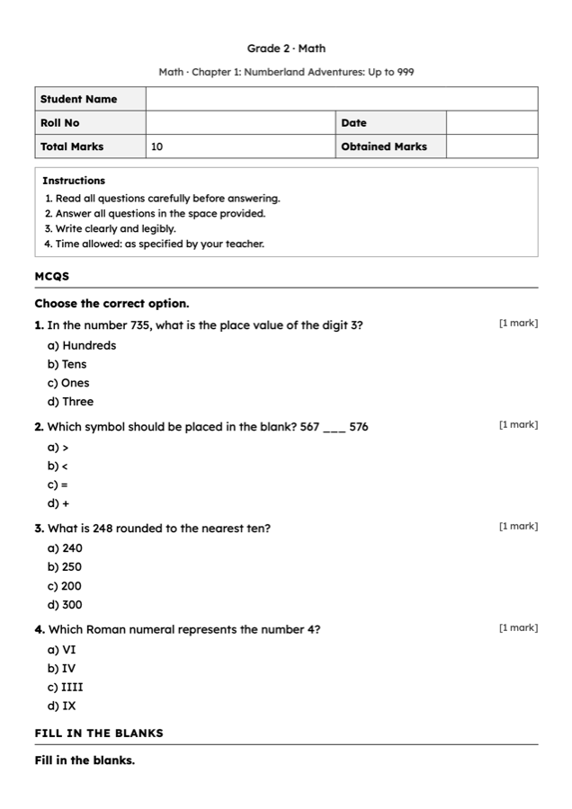

# 📝 Test Papers



> A teacher picks a chapter (or a whole unit) from material the deployment already has and gets a
> **printable test paper with a separate answer key**, in the chat, in about a minute. Every edit makes a
> new version; "my papers" re-sends any of them.

## What it is

Writing a fair paper from the textbook takes a teacher an evening. Rumi does it from the material itself:
the teacher chooses what the paper covers, how big it is and which language it is in, and receives two PDFs
— the paper a child writes on (no answers, ruled lines sized to the grade, a marks header) and the answer
key, numbered to match. A paper is only ever built from real material: if there is nothing to build it
from, the teacher is told so, and the model is instructed to refuse rather than invent questions about
things the material does not teach.

The word "assessment" is deliberately not used: in Rumi it means the reading assessment.

## Where the questions come from

| Source | What it is | How it gets there |
|---|---|---|
| **Textbooks** | Chapters of books loaded into `textbooks` / `textbook_toc` / `textbook_pages` | `node bot/scripts/testpaper/import-curriculum-corpus.js <corpus-dir>` loads the [curriculum pipeline](../../curriculum/README.md)'s page-truth output (`01_page_truth/<book>/`). Idempotent; `--dry-run` shows what it would write. |
| **The teacher's own lesson plans** | Their recent `lesson_plans` | The plan's saved content (a plan Rumi made keeps its PDF's text as `content.plan_text`), or the text of its PDF. |
| **An uploaded chapter** | A PDF (with a text layer), a Word file or a text file — or pasted text | Sent in the chat when Rumi asks for it. |

A scanned PDF with no text layer, or a lesson plan saved with only its topic, is refused honestly.

## What the teacher experiences

```
/testpaper            → What should the paper cover?   Grade 2 · Math (15 ch.) · My lesson plans (4) · Send a chapter · My papers
  Grade 2 · Math      → Which chapter?                  1. Numberland …  2. Add-It-Up …  … All of them (whole unit)
  1  (or 1,3 · 1-4 · all)
                      → How big a paper?                Quick check · 10 Qs · Standard · 20 Qs · Full paper · 30 Qs
                                                        (or type a mix: "5 MCQs, 3 true/false, 2 short questions")
  Quick check         → Paper language?                 English · اردو · العربية · …
  English             → 📝 Making your test paper — Math · Chapter 1: … · 10 questions · English.
                      → 📄 TestPaper_Math_….pdf    🔑 TestPaper_Math_…_AnswerKey.pdf
                      → Your paper has 10 questions worth 10 marks. Want to change anything?
                         ✏️ Edit this paper · ➕ New paper · 📂 My papers
  Edit this paper     → What should change?  "make it easier and add 2 true/false questions on rounding"
                      → ✏️ Making version 2 …  → the version-2 paper + key (version 1 stays as it was)
```

- **`/testpaper`** or **`/paper`** starts it; **`/testpaper science`** narrows the menu to one subject (and
  says honestly when there is no material for it). **`/mypapers`** lists the teacher's papers, latest
  version first.
- **Every channel.** Each pick is an interactive list or reply buttons: native on WhatsApp, a numbered menu
  on Baileys, Matrix, Slack and Discord (reply with the number or the name). Multi-picks and typed mixes are
  plain text. No WhatsApp Flow is needed.
- **Right-to-left papers.** A paper in Urdu is set right to left in Nastaliq; papers in other
  Perso-Arabic-script languages (Arabic, Persian, Pashto, …) in Naskh. The fonts travel inside the PDF; marks and numbers stay left to right.

## How it works

1. **Conversation** — [testpaper-orchestrator.service.js](../../bot/shared/services/testpaper/testpaper-orchestrator.service.js),
   reached from [testpaper-trigger.js](../../bot/shared/handlers/testpaper-trigger.js) (commands and pending
   picks) and `tp_` list/button ids in [whatsapp-bot.js](../../bot/whatsapp-bot.js). Its place in the
   conversation lives in [testpaper-session.service.js](../../bot/shared/services/testpaper/testpaper-session.service.js)
   (Redis, 30-minute TTL, memory fallback).
2. **Source text** — [testpaper-sources.service.js](../../bot/shared/services/testpaper/testpaper-sources.service.js)
   reads the chapter(s), lesson plan(s) or upload **before anything is queued**, so empty material is told to
   the teacher at once. The text is stored on the request, so every later version is built from exactly the
   same material.
3. **Queue** — the request (`test_paper_requests`) and version 1 (`test_papers`, `generating`) are written,
   then a `testpaper_generate` job is queued; an edit queues `testpaper_revise` for the next version.
4. **Generation** — [testpaper.worker.js](../../bot/workers/testpaper.worker.js) calls
   [paper-generation.service.js](../../bot/shared/services/testpaper/paper-generation.service.js): one model
   call with the neutral prompt pack ([testpaper-prompts.json](../../bot/shared/services/testpaper/testpaper-prompts.json))
   — role, subject-family guidance, the JSON contract, the answer-key rule, a final checklist, safety last —
   and JSON output. The answer is then made true where the model was careless: the marks budget, MCQ answers,
   stray image keys. Question types per subject family live in
   [question-types.js](../../bot/shared/services/testpaper/question-types.js).
5. **Printing and delivery** — [paper-renderer.js](../../bot/shared/services/testpaper/paper-renderer.js)
   lays out the paper and the key as self-contained HTML; [testpaper-delivery.service.js](../../bot/shared/services/testpaper/testpaper-delivery.service.js)
   prints both with the repo's [html-to-pdf](../../bot/shared/utils/html-to-pdf.js) (headless Chromium) and
   sends them through the messaging facade, followed by the edit offer. PDFs are not stored: they are
   re-rendered from the stored version on every send, so no object storage is needed and a re-send can never
   drift from what was printed.

The model comes from [config/model-registry.js](../../bot/shared/config/model-registry.js)
(`resolveModelForJob('testpaper.generate')`), read per request.

## Enable it

On by default: test papers need only the LLM key every deployment already has (`OPENROUTER_API_KEY`, or
`OPENAI_API_KEY` with `LLM_PROVIDER=openai`). To use them:

1. **Apply the schema** — fresh installs get the tables from `00_complete-schema.sql`; existing deployments
   run `infrastructure/supabase/migrations/V2.8.0__test_papers.sql` (additive: two new tables).
2. **Give the bot a Chromium** for printing — the same one the reading report uses
   (`PLAYWRIGHT_CHROMIUM_EXECUTABLE_PATH`, or a system `chromium`). Without it the teacher is told plainly
   that PDFs cannot be printed yet.
3. **Run the worker** (`node bot/workers/sqs-worker.js`) — papers are written there.
4. **Load material** (optional, but it is what makes "from the book" work):
   ```bash
   node bot/scripts/testpaper/import-curriculum-corpus.js path/to/curriculum-project --dry-run
   node bot/scripts/testpaper/import-curriculum-corpus.js path/to/curriculum-project
   ```
   Without textbooks, teachers can still build papers from their own lesson plans or an uploaded chapter.

| Variable | Default | What it does |
|---|---|---|
| `TESTPAPER_MODEL` | `google/gemini-2.5-pro` (`gpt-4.1` with `LLM_PROVIDER=openai`) | The model that writes and revises papers. Any OpenRouter id. |
| `TESTPAPER_CURRICULUM` | _blank — every loaded textbook_ | Offer only textbooks of these curriculum keys (comma-separated; the importer's `--curriculum`). |
| `RUMI_FEATURE_TEST_PAPER` | _blank_ | Set to `off` to switch test papers off without touching anything else. |

## Data

`test_paper_requests` (the ask: source kind/reference/label, the source text, subject, grade, language,
question mix) and `test_papers` (one row per version: `version`, `edited_from`, `edit_instruction`, `status`,
`title`, `exam_json`, counts, model and tokens, `error_code`). A ready version is never rewritten.

## Limits

- Papers carry no pictures: questions that need a diagram are rewritten to be answerable from text or left
  out. A "label the diagram" question asks the child to draw it.
- Seen questions (lifted from the book's own exercises) are supported by the generator but not yet offered
  in the chat; papers are built from new questions on the material's concepts.
- `/menu` does not list test papers yet; the commands are the way in.
